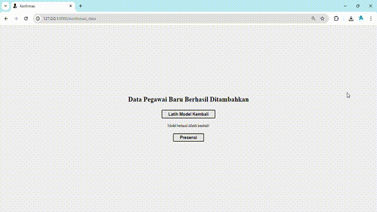

# Attedance System
Projek ini adalah sistem presensi berbasis pengenalan wajah yang dirancang untuk memudahkan pencatatan kehadiran pegawai.

Sistem ini bertujuan untuk mengembangkan sistem _Face Recognition_ yang akan terintegrasi dengan sistem presensi yang sudah ada, sehingga memungkinkan pencatatan kehadiran pegawai secara otomatis saat wajah mereka terdeteksi.

    <h2> Tabel konten </h2>
    <ul>
        <li>
            <a href="#Instalasi">Panduan Instalasi</a>
        </li>
        <li>
            <a href="#Penggunaan">Panduan Pengguaan</a>
        </li>
        <li>
            <a href="#Model">Pembangunan Model</a>
        </li>
    </ul>

    <h2>
        <a href="#tabel-konten">Panduan Instalasi</a>
    </h2>

Hal yang perlu dipersiapkan:

1. Python versi 3.10 ke atas. [Cara Memasang Python](https://wiki.python.org/moin/BeginnersGuide/Download)
2. Library tambahan, pasang dengan cara mengetik perintah `pip install -r requirements.txt` di terminal di mana direktori file `requirements.txt` berada
3. Basis data MySQL versi 8, _import_ basis data dari direktori `db`
4. Untuk menggunakan basis data, bisa menggunakan XAMPP atau Laragon atau WAMP

    <h2>
        <a href="#tabel-konten">Panduan Penggunaan</a>
    </h2>

1. Buka terminal
2. Jalankan perintah `python app.py`
3. Jika aplikasi sudah ada tulisan _Running on http://127.0.0.1:5000_, buka browser dan akses `http://localhost:5000` atau `http://127.0.0.1:5000`
4. Akan ditampilkan kamera untuk mendeteksi wajah pegawai
5. Klik tombol presensi untuk menangkap foto presensi
6. Setelah menekan tombol presensi, maka presensi berhasil dilakukan dengan menampilkan identitas pegawai serta bukti foto
6. Proses presensi berhasil dilakukan dan presensi bisa dilakukan kembali dengan menekan tombol `Presensi Ulang` 

  

7. Untuk menghentikan program, kembali ke terminal dan tekan tombol `CTRL + C`

### Menambahkan Data Pegawai Baru
1. Ketika program berjalan, klik `Tambah Data` di browser

2. Masukan id_pegawai dan ambil 10 gambar baru

  

3. Jika semua sudah terisi, klik `Simpan Gambar` untuk menambahkan data pegawai tersebut ke basis data

  

4. Setelah data berhasil ditambahkan, klik `Latih Model Kembali` untuk data baru dan tunggu beberapa saat.

  

4. Jika sudah selesai, maka akan tampil pesan `Model berhasil dilatih kembali!`. Klik `Presensi` untuk memulai presensi kembali

  

    <h2>
        <a href="#tabel-konten">Tahapan Pembuatan</a>
    </h2>

Sistem ini mempunyai tahapan pembuatan sebagai berikut:

  

#### Pengumpulan Data
Data yang digunakan berupa gambar 17 orang yang diidentifikasi sebagai pegawai untuk sistem absensi yang sudah ada. Data latih model dapat diakses [di sini](https://github.com/WiseStar282/FaceAttend/tree/main/Face%20Images). 

#### Eksplorasi Data
Eksplorasi data berupa visualisasi untuk memahami karakteristik dataset, seperti distribusi data dan variasi fitur wajah.
|Jumlah Gambar|Sampel Gambar|
|:-:|:-:|
|||
|Distribusi Piksel|Distribusi Ukuran Data|
|||

#### Pembagian Data
Total data adalah 326 gambar yang dibagi menjadi data train (259 gambar) dan testing (67 gambar)

#### Pembangunan Model
Pada sistem ini, model _face recognition_ dibangun menggunakan model arsitektur CNN MobileNet V2. Kode program dapat diakses [di sini](https://github.com/WiseStar282/FaceAttend/blob/main/model/Face%20Recognition%20Using%20CNN.ipynb). 

#### Evaluasi Model
Setelah model dibangun, akan dilihat performa model dari grafik akurasi dan loss pelatihan dan testing. Selain itu dilihat confusion matrix dan classification reportnya.

#### Export Model, Integrasi Sistem
Setelah model dibangun, model akan diexport dan diintegrasikan pada sistem yang telah dibangun. Panduan instalasi dan panduan penggunaan telah disampaikan sebelumnya.
